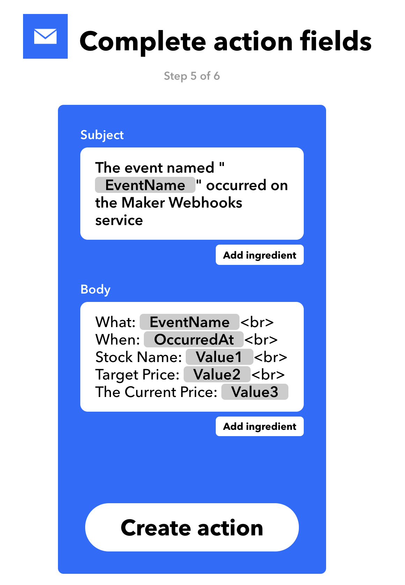

## This is the final project of OSS Lab(HGU, 2020-1)
**Project name: Stock price teller bot**

## What does this project do?

**Stock price teller bot** is an automatic tool for watching the stock price that a user want in a real time.
When a user want to keep watching some stock price with the expected value, just use this bot and take some notification in your email.

## Why is this project useful?
In these days, there are many platforms and applications providing stock makret information. 
However, it is very complicated for the beginners to use the functions in that application. 

As a result, the beginners get tired of using the applications.
In that case, this project might be helpful. You just type the stock lists that you are interested in. 
Then, the bot start to keep watching the stock list in a real time and send an email to an user when the stock is price is over the expected value.

## How do I get started?

1. First, Go to the link [iffft](https://ifttt.com/) and sing up or sign in.

2. Make the service for taking some notifications from our stock bot.
  1. Click the 'This' and find and make the 'webhooks'
  
  2. Click the 'That' and find and make the email servie as below. 
   

  

## Where can I get more help, if I need it?

